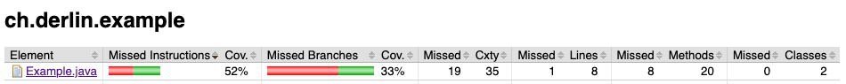
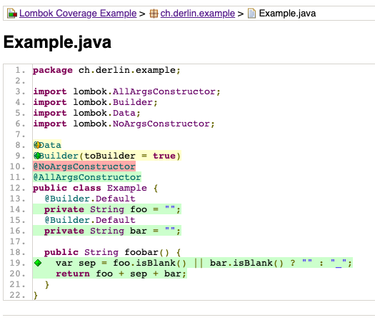
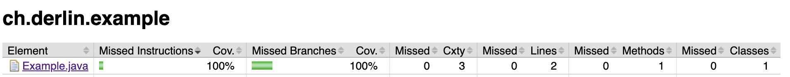

[Lombok](https://projectlombok.org) is an amazing library that reduces boilerplate code in Java thanks to annotations processed at compile time. I use it heavily in my personal and professional projects.

I recently discovered a downside though: lombok generated methods are considered as "regular" code by the coverage libraries. If you have lots of them, the coverage reported by JaCoCo or SonarQube can thus be wa(aaaa)y lower than expected.

## Example problem

Take the following class:

```java
@Data
@Builder(toBuilder = true)
@NoArgsConstructor
@AllArgsConstructor
public class Example {
  @Builder.Default
  private String foo = "";
  @Builder.Default
  private String bar = "";

  public String foobar() {
    var sep = foo.isBlank() || bar.isBlank() ? "" : "_";
    return foo + sep + bar;
  }
}
```

We write the following test, which is not very elegant but **covers all the lines**:

```java
class ExampleTest {

  @Test
  void fooBar() {
    Map.of(
        Example.builder().build(), "",
        Example.builder().foo("foo").build(), "foo",
        Example.builder().bar("bar").build(), "bar",
        Example.builder().foo("foo").bar("bar").build(), "foo_bar"
    ).forEach((example, expected) ->
        assertThat(example.foobar()).isEqualTo(expected));
  }
}
```

Using JaCoCo, the reported coverage is however **as low as 33%** !





## Solution

To fix this, we need a way to tell JaCoCo to ignore lombok generated code. This is possible by instructing lombok to annotate all the generated method with `@lombok.generated`, which JaCoCo will ignore automatically.

Create a `lombok.config` file with the following:

```bash
# This tells lombok this directory is the root,
# no need to look somewhere else for java code.
config.stopBubbling = true
# This will add the @lombok.Generated annotation
# to all the code generated by Lombok,
# so it can be excluded from coverage by jacoco.
lombok.addLombokGeneratedAnnotation = true
```

And put it either at the root of your repo, or in the `src/` folder. The only requirement is that all code with lombok annotations is found below or alongside this file.

And there you have it !


