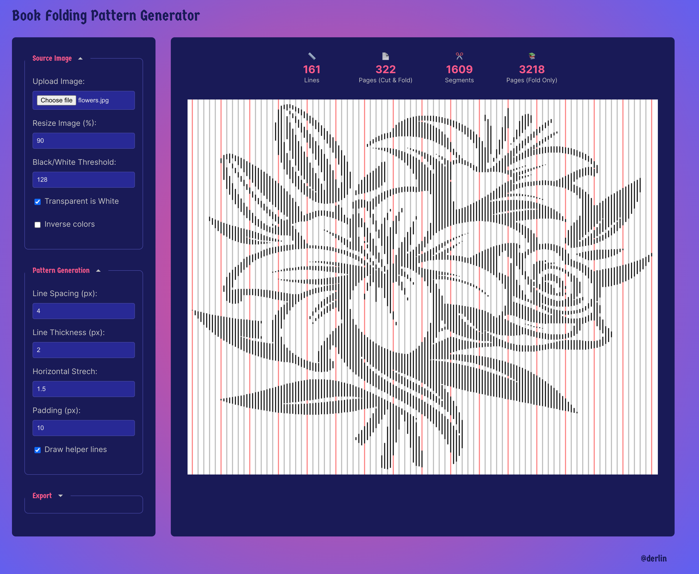
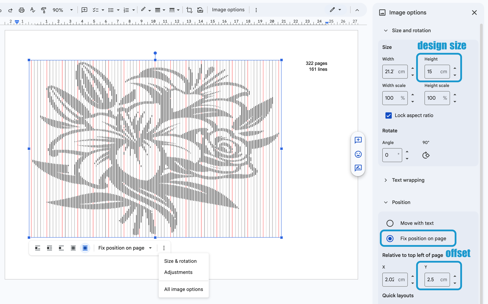
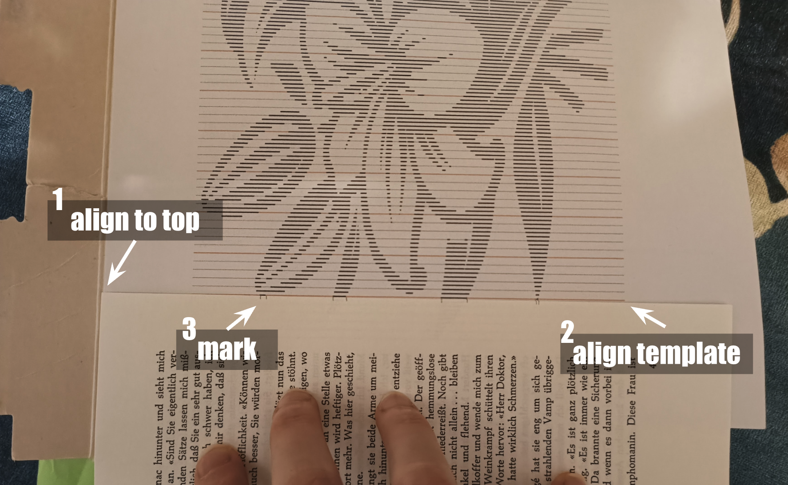
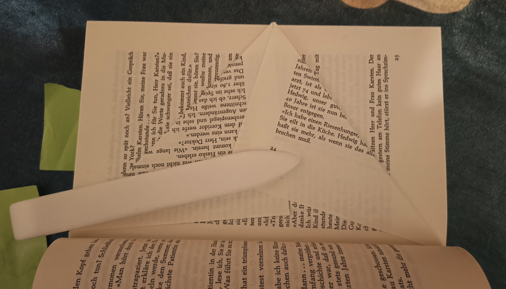
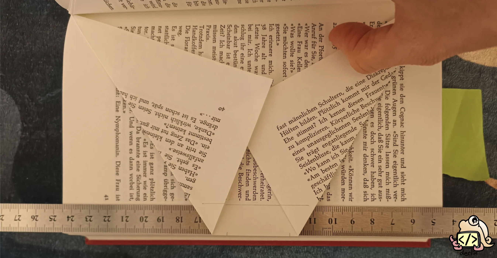
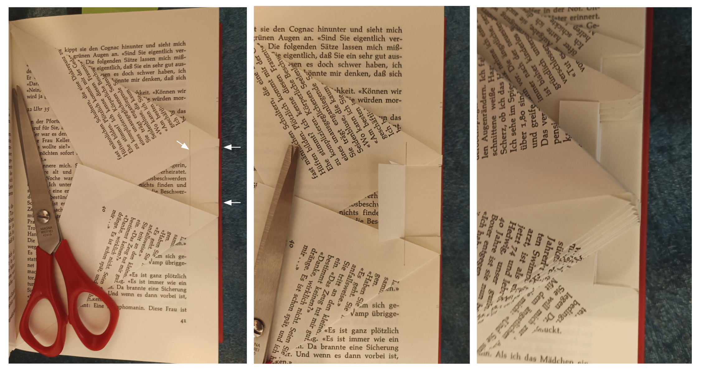

In [my previous article](../intro-to-book-folding/), I shared how I fell down the rabbit hole of
book folding. As promised, here is a complete tutorial on how to create your own book-folding art
using a simple technique that I call "line templates".

To generate the line template, we'll be using a free tool I built specifically for this:

✨✨ ⮕ <a href="https://bookfold.derlin.ch" target="_blank" rel="noopener
noreferrer">bookfold.derlin.ch</a> ⬅ ✨✨

> [!note] Unleash your creativity
> 
> Note that while this tutorial focuses on a specific design, it is just one of many possibilities.
Different designs and all the techniques I mentioned in
[my introduction to book folding](../intro-to-book-folding/#diving-into-the-possibilities-of-book-folding)
can be achieved using the same process!

Jump to the [conclusion](#conclusion) to see the final result.

## Requirements

**<u>Mandatory:</u>**

* A **printer** and an internet connection.
* A **hardback book** with at least 161 physical pages (or 322 numbered pages), ideally a few dozen
  more.

  > [!caution]
  > 
  > A book with 320 numbered pages actually has 160 physical sheets of paper (leaflets). Moreover,
  > most books do not start the numbering at 0, so be mindful when counting your pages.

* **Scissors**.
* A **pencil** (that is ideally easy to erase).
* Some spare time 😉.

*Nice-to-have:*

* A ruler 1 to 1.5 cm wide.
* A **bone folder** (Teflon ones are the best for crisp lines).
* A **small piece of cardboard** (to help manage the pattern).
* An **eraser**.

## 1. Find a good image

First, you need a design. I usually browse [Pinterest](https://www.pinterest.com/) for inspiration,
looking specifically for "*black and white*", "*silhouettes*", and "*stencils*". The more details,
the higher the number of pages you will need. You will have to play with the tool (and the process)
multiple times to build your intuition on what works and what doesn't.

For this tutorial, we will create a [combi fold](../intro-to-book-folding/#the-combi-fold) using
this flower design:

## 2. Generate the pattern

Navigate to [bookfold.derlin.ch](https://bookfold.derlin.ch). It's a totally free line pattern
generator I created to make everything easier. Piece of advice: it easier to use on desktop!

### Processing the image
Save the flower image above and upload it in [bookfold.derlin.ch](https://bookfold.derlin.ch) using
the **Source** panel on the left. The tool will automatically trim the empty pixels and convert it
to black (design) and white (background).

Optionally:

*   **Resize Image:** Adjust the size (in percent) to fit your vision. This directly impacts how
    many pages you'll need to fold. For this tutorial, I resized the image to <u>90</u>%.
*   **Black/White Threshold:** If your image is a bit "noisy" or grayscale, play with the threshold
    (default is `128`) to decide exactly what becomes a black segment and what stays white.
*   **Inverse colors:** Useful if you want the "background" to be popping up instead of the
    "design".

### Fine-tuning the pattern
The tool scans your image horizontally and takes samples every few pixels.

*   **Line spacing:** This is the most important setting. A higher spacing means fewer details but
    also fewer pages to fold. For this tutorial, I used a <u>spacing of 4</u>.
*   **Horizontal Stretch:** This makes the printed pattern easier to read by "stretching" it
    sideways. It doesn't change the final look of the book, but it saves your eyes from squinting! 1
    means 100% (no stretch at all). I usually set this to <u>1.5</u>.
*   **Line Thickness:** I recommend <u>2 pixels</u>, so the segments are clearly visible once
    printed (make it even bigger on cheap printers).
*   **Padding**: This adds some padding around the design, so the helper lines are always visible. I
    usually set it to <u>10</u> pixels.

### Exporting
Once you're happy, check the **Pattern Info** at the top. It will tell you exactly how many
**lines** (physical sheets) and **pages** (numbered pages) will be required.

> [!note]
> 
> The tool shows four values: lines/pages (Cut & Fold), segments/pages (Fold Only). The latter is
> only useful if you plan to do a [traditional book fold](../intro-to-book-folding/#fold-only).

If you followed along, you should see **161 lines**, which means a book with at least **322 numbered
pages** (again, beware of the page numbers, they do not always start at zero!).

## 3. Select and prepare your book

Now, you need a book that matches your pattern.

*   **Page count:** Our pattern needs 322 pages. Look for a book with at least 340+ pages to give
    yourself a safety margin at the beginning and end.
*   **Colors**: Avoid books with colored or glossy pages. If there are just a few interspersed here
    and there, remove them before you start.
*   **Paper quality:** Avoid books with very thin paper; they don't hold the "pop" of the fold as
    well, and you risk tearing them during folding. Also be aware that the thicker the paper, the
    heavier the resulting book fold. If it is too heavy, it might not stand up on its own.

Once you found your book, measure the height of a single page (e.g. 20 cm).

## 4. Print the pattern

The pattern needs to be printed at the right size and at the right offset (so the design is centered
properly).

Let's say your book *pages* are **20 cm** tall. You want some margin at the top and bottom of the
design: **2.5 cm** is usually a good value, so the design should be **15 cm** tall
(`20 - (2 x 2.5)`). To center it, you'll need a **2.5 cm offset** from the top.

In other words, you need to print the template on a landscape A4 paper, 2.5 cm from the top and with
an height of 15. There are multiple ways of achieving this, but here is my "pro" workflow for
printing:
1.  Copy the template from the tool (*right click* > *copy*) and paste it into a **Google Doc**
    ([docs.new](https://docs.new)).
2.  Set the page orientation to **Landscape**.
3.  Click the image and open **Image options**:

    * Under **Size & Rotation**, set the **height** to **15 cm**.
    * Under **Position**, select "**Fix position on page**" and set the offset (*relative to top
      left of page*) **Y** to **2.5 cm**.

## 5. Compute the start page

To center the design within the book, we need to find the right starting page. The book I am using
has the first page numbered `5`, and the last page numbered `357`.

1.  Find the usable range: (last page number) - (first page number). For me: `357 - 5 = 352`.
2.  Subtract the pattern pages (322): `352 - 322 = 30` spare pages.
3.  Divide by two for the margins: `30 / 2 = 15` pages.
4.  Add the offset: since the book starts at page 5, my first folded page will be numbered
    `5 + 15 = 20`.

I usually start one or two pages earlier (page 18 in this case) to have some spare if I make a
mistake.

## 6. Let's fold!

> [!tip] Tip: Work in small batches!
> 
> Complete the whole process (marking, cutting, and folding) for just the first 5 pages before
> moving on. Working in batches makes it much easier to catch mistakes early and recover without too
> much hassle. Once you feel comfortable, you can increase your batch size to 10 or 20 pages at a
> time.

### Step 1: Mark the pages
Place the pattern behind your first page. Align the top of the pattern with the top of the book, and
the first vertical line with the edge of the page.

Draw small **marks** at the start and end of every black segment using a pencil. When you're done
with a line, draw a dot at the top of the pattern line on your template to mark your progress (so
you know where you are).

> [!tip]  
> Scotching the pattern on a piece of cardboard makes the pattern easier to grab and move. Move the
> cardboard once you get further into the design. This is not necessary, but I found it helps!
> 
> 

Head over to the second page and repeat. Do this for the batch.

### Step 2: Fold the edges
Go back to the first page you marked. Fold the **top-most** and **bottom-most** marks all the way to
the book's binding. If there are marks in the middle, leave them for now; those are for cutting.

### Step 3: The helper line (optional)
Draw a faint vertical line about 1.5 cm from the edge of the page. This is your "stop" line. It
ensures all your cuts are the same depth, which makes the final result look much more professional.

Having a ruler of about 1.5 cm wide in this step is quite helpful 😉.

### Step 4: Cut and fold
For all the marks in the middle of the page (all but the first and last marks):
1.  **Cut** horizontally from the mark to your helper line. Try to keep the cut as straight as
    possible!
2.  **Fold** every other tab back toward the binding. The rule of thumb: the very top and very
    bottom sections are always left *unfolded*.

> [!tip]  
> If you're a perfectionist, use an eraser to remove your pencil marks after cutting (but *before*
> folding). This makes the result cleaner, but it is totally optional. The marks are very faint
> anyway; they will only show upon close inspection.

### Step 5: Repeat

Repeat this for every page in your pattern, batch by batch, and watch your design slowly emerge from
the pages!

## Conclusion

How does your final book look like? Here is mine:

<video controls width="514" height="620" style="border-radius: 8px; margin: 1.5em 0; max-width: 100%; max-height: 100%">
    <source src="https://github.com/derlin/astro-blog/raw/refs/heads/main/result.mp4" type="video/mp4">
    Your browser does not support the video tag.
</video>

If you're looking for more inspiration, remember to check out
[my introduction to book folding](../intro-to-book-folding/) for more variants, techniques, and
ideas. And if [bookfold.derlin.ch](https://bookfold.derlin.ch) has proven useful to you, feel free
to share it around (I would like it very much 😊).

Happy folding!

