After my [mini-books](diy-my-guide-to-making-miniature-book-replicas-full-tutorial) and other book-related crafts, I needed a new hobby. Since December last year, I started what we call “book folding”, the art of folding and cutting the pages of a hardback book to create works of art.

After trying out multiple techniques and processes, I developed a straightforward process of my own that I am excited to share. But before I jump into a full tutorial, I would like to explain how I came to book folding and what exactly it entails. Consider this article a “preparation step”!

## How I started book folding

I stumbled upon book folding pictures while browsing the internet in search of 
new ways to craft around books. It looked amazing, and doable with my skill set! I instantly started looking for tutorials.

### All in the folds - too much of a hassle

The first resource I found interesting was allinthefolds: [https://www.allinthefolds.co.uk/free-patterns/](https://www.allinthefolds.co.uk/free-patterns/). This website offers free patterns along with step-by-step instructions. However, their approach, called **MMF (Measure, Mark, and Fold)**, is quite a hassle: they provide a table mapping each page to specific measures that you need to mark on the page, then fold. It requires discipline and doesn’t look like much fun. As an example, here is the pattern for a simple heart:

[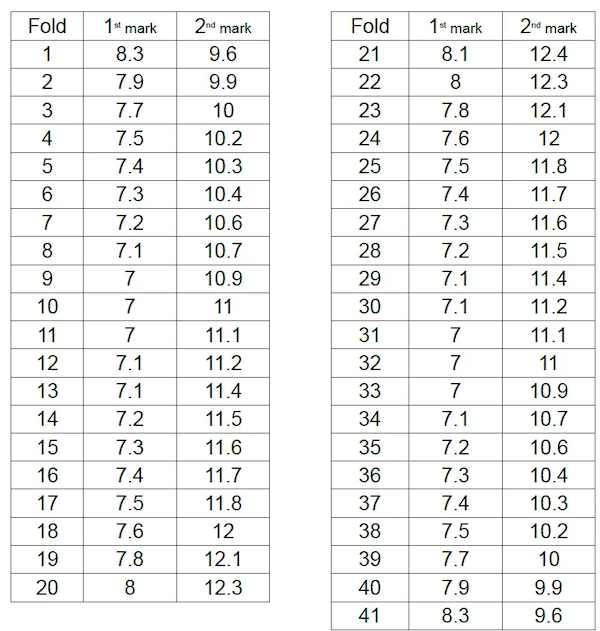](https://www.allinthefolds.co.uk/beginner/freeheart/)

Source: [https://www.allinthefolds.co.uk/beginner/freeheart/](https://www.allinthefolds.co.uk/beginner/freeheart/)

### The perfect starter pack for beginners - Heather Eddy Art

Fast-forward a few hours, and I finally found my perfect starter pack: [https://www.heathereddyart.com](https://www.heathereddyart.com). Heather has a unique technique to create geometric patterns, which is perfect for beginners. She also shares a [free PDF with instructions and examples](https://www.heathereddyart.com/2019/12/how-to-make-folded-books-by-heather.html). Here is an example pattern from Heather:

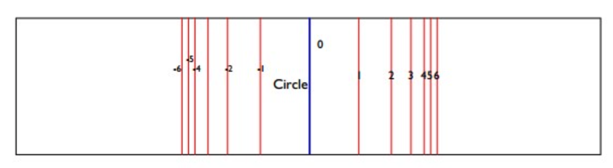

And here is my result after following her instructions:

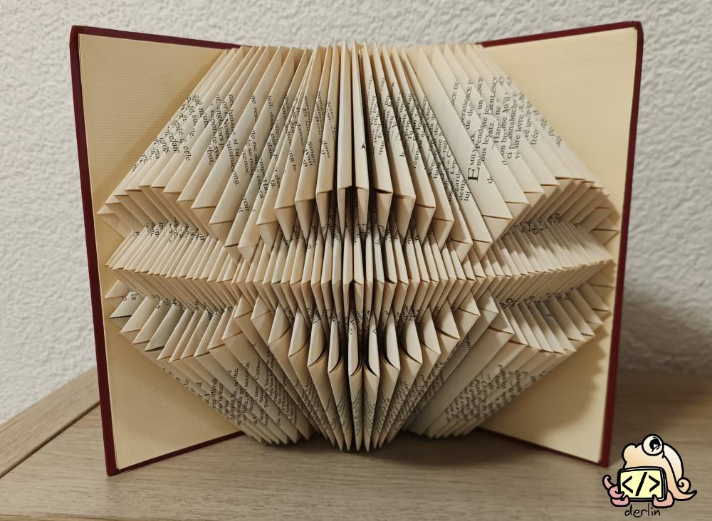

### The holy grail - scrappystickyinkymess and the line templates

The geometric shapes looked great, but they weren’t at the level of the art I saw online. I wanted complex visuals and text, but I refused to compromise on the fun. No measurements page by page (MMF), please.

The blog “[useless beauty?](https://scrappystickyinkymess.wordpress.com)” came to my rescue. This “*American living in the UK*” uses a simple **“line templates” technique** that yields complex and beautiful results with just a lined sheet of paper. No rules involved! Assuming you have the line template and past the initial computations to determine the number of pages involved and where to start, the rest of the process is virtually effortless.

To understand, the best is to look at his (her?) free templates available [here](https://scrappystickyinkymess.wordpress.com/folded-book-templates/). For example, take the “read” template (downloadable [here](https://scrappystickyinkymess.wordpress.com/wp-content/uploads/2016/09/read_stretched.pdf)):

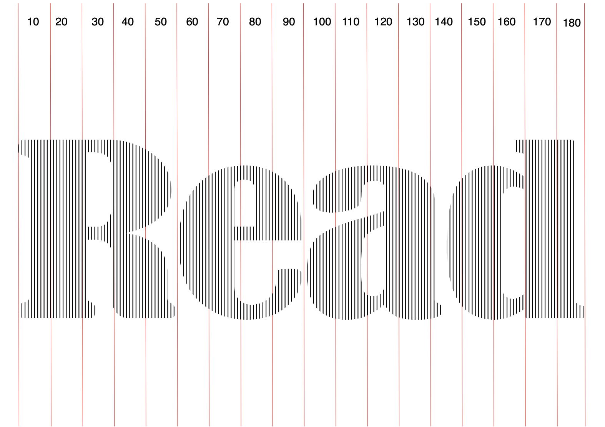

Once you have printed the template, go page by page, always aligning the top of the book page with the top of the pattern. Mark the start and end of the black segment (important: one segment equals one page!), and then fold. Following these instructions, I created my second bookfold:

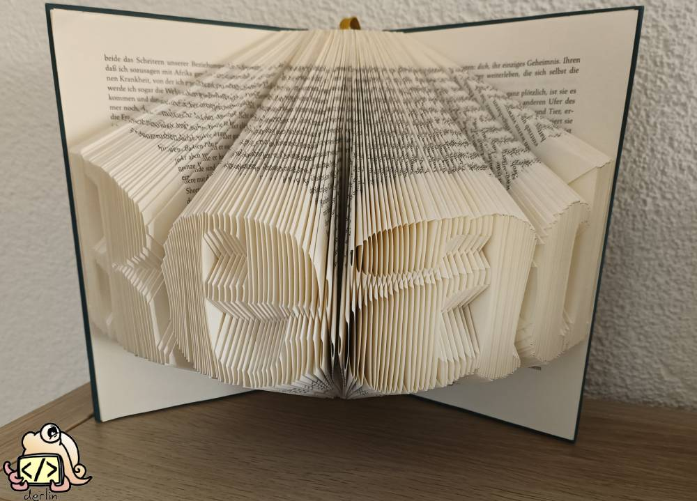

I had found my process! Now, I just needed a simple way to create line templates from any images. Being a software engineer, I created my own tool… which will be the subject of my next post! But first, let me give you a taste of what book folding (with line templates) can do.

## Diving into the possibilities of book folding

So far, my attempts have been strictly limited to folding pages. My “read” pattern above uses one page per black segment, even when multiple segments appear on the same vertical line. This requires a lot of pages and creates a bulky, heavy look.

However, book folding is a generic term that covers various techniques and can also involve cutting (**“Cut & Fold”)**. I am still exploring the many possibilities and terminologies, which differ widely depending on the source, but let’s review the most common ones.

> [!note]
> For an alternative overview of the Cut & Fold techniques, see https://www.cutandfoldbookart.com/cut-and-fold-method-instructions/

### Fold Only

This is the traditional method I first tried.

The traditional bookfold corresponds to my first tries that I described above. The design is created entirely with folds, no cutting involved. In the community, this is often what people mean when they talk about MMF (Measure - Mark - Fold), although I personally use it more specifically for a type of pattern.

### Cut & Fold

As the name suggests, Cut & Fold involves scissors. Depending on the variant, it may also involve folding, often as a preparatory step (such as insets or the 180-degree fold - keep reading!). The cuts allow for much more intricate designs using fewer pages and are the most common types of book fold you will encounter online.

### Inverted and Embossed (or “Innie” and “Outie”)

When using Cut & Fold, the primary question is which part to fold: the design itself or the background. This is known as “**inverted**” vs “**embossed**”, or, more colloquially, “**innie**” vs “**outie**”:

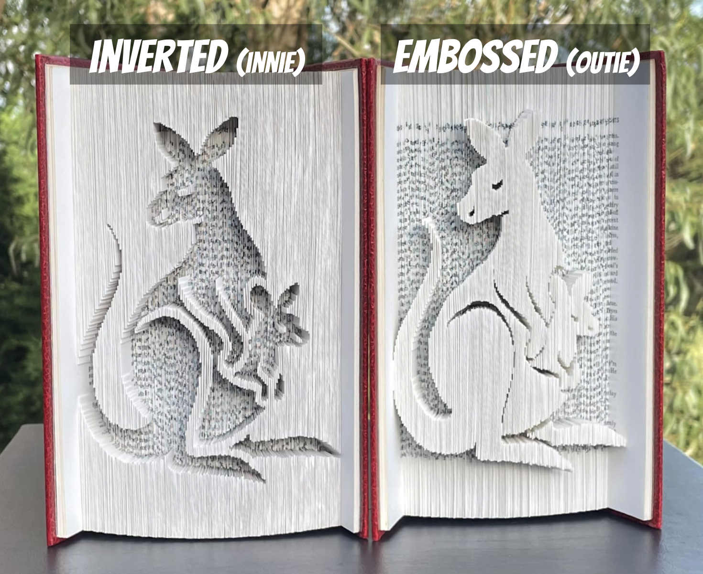

(*image sources*: [facebook](https://www.facebook.com/groups/5184584998270591/permalink/8213608122034915/))

### Shadow and Partial Fold (with inset pages)

Another variant is the “**shadow fold**” (sometimes called a “**partial fold**”). In this case, you only fold every other page (one page every X), thus making the result softer (less crisp), more “shadowy”, and the design fuller.

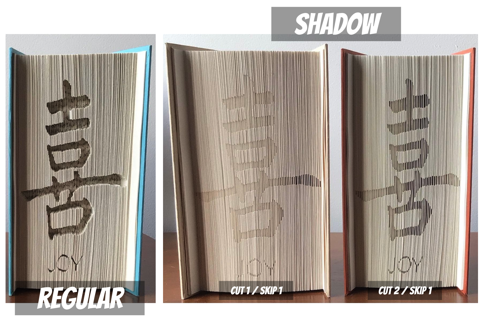

(*image sources*: [facebook](https://www.facebook.com/groups/2625484907576770/permalink/3907511172707464/))

The unused pages in between the folded parts of the design are called **inset pages**. In a typical shadow fold, these inset pages are left untouched (unfolded). A variant consists of folding the inset pages at around 1-3 cm (like in the 180-fold, see below), which makes the design crisper while maintaining bulk and stability (“fullness”).

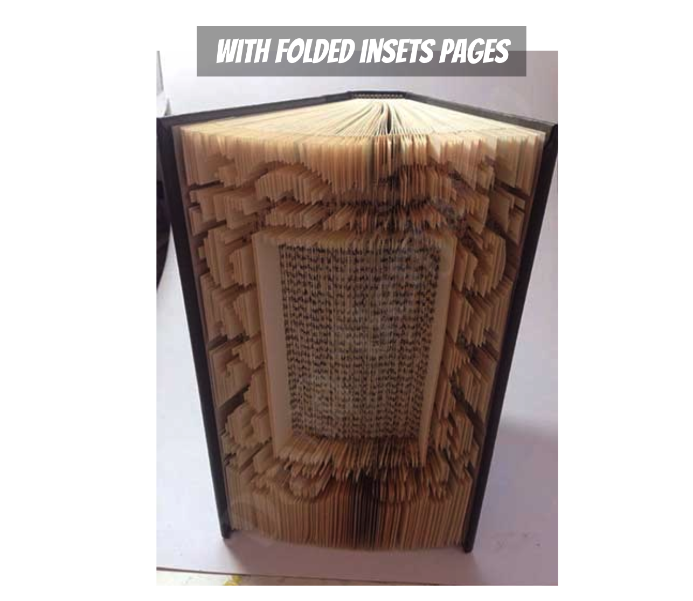

(*image source*: [cutandfoldbookart.com](https://www.cutandfoldbookart.com/cut-and-fold-method-instructions/))

### The 180-fold

Folded insets and shadow folds have the advantage of creating a fuller, bulkier result. Another way to play on the “volume”, or the width of the result, is known as the “**180-degree fold**”, or **180** for short.

A 180 consists of folding every page of the book back towards the spine to create a uniform, thick, and sturdy base *before* doing the pattern. This preparatory step can then be combined with any of the Cut & Fold techniques we discussed (innie, outie, shadow fold, …).

You can see below the book base before a pattern, followed by an embossed 180° Cut & Fold:

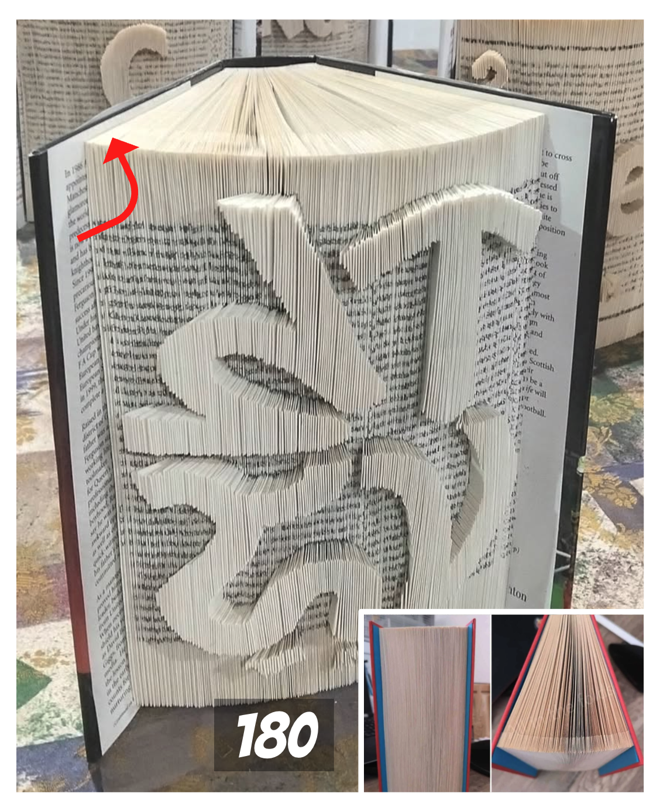

(*image sources*: [www.allinthefolds.co.uk](https://www.allinthefolds.co.uk/180-fold/), [facebook](https://www.facebook.com/groups/2625484907576770/permalink/3907511172707464/))

### The combi fold

Finally, one of my favorite techniques is the “combi fold”: the combination of regular Book Fold with Cut & Fold. The idea is to use traditional folding for the first and last marks on the page, then cut and fold any remaining marks in between. The result is stunning!

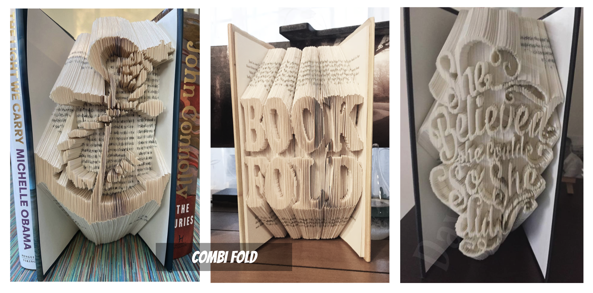

(*image sources*: [facebook](https://www.facebook.com/groups/690254855057097/permalink/1854720588610512/), [folksy.com](https://folksy.com/items/8429394-Book-Fold-COMBI-Book-Folding-Pattern-EMAILED-PDF-PATTERN), [www.cutandfoldbookart.com](https://www.cutandfoldbookart.com/product/believed-cut-fold-book-folding-pattern/))

## Advanced techniques

I am not that far into book folding yet, but I wanted to mention two advanced techniques that I often encountered, but never tried myself.

### Cardstock coloring

This technique adds color(s) to the design by inserting thin strips of colored cardstock into the folds. By "wrapping" the fold around the cardstock, the color becomes the visible edge of that specific segment. This requires planning and patience, but the results are really marvelous.

*(image sources*: [YouTube](https://www.youtube.com/watch?v=XzRxx6X3UNA), [facebook](https://www.facebook.com/groups/5184584998270591/permalink/26035205292781924/), [facebook](https://www.facebook.com/groups/5184584998270591/permalink/26017392231229897/), [facebook](https://www.facebook.com/groups/5184584998270591/permalink/25927196570249464/))

### Multi-layer Cut & Fold

This is a step up from the standard Cut & Fold. The idea is simple: vary the depths or angles of the folds for different parts of the design to make some pop and others recede, creating a 3D effect.

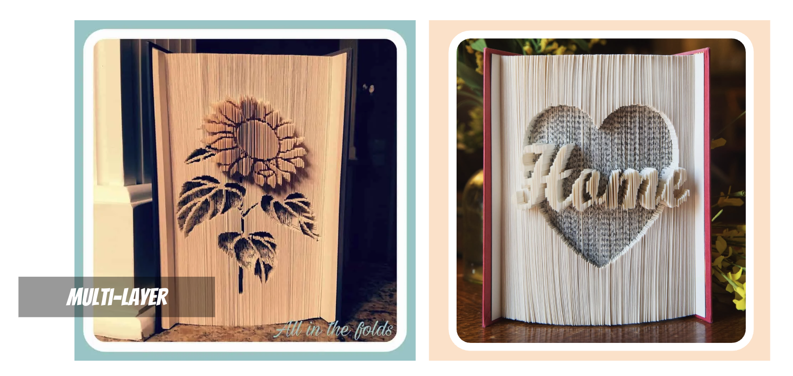

(*image sources*: [www.allinthefolds.co.uk](https://www.allinthefolds.co.uk/sunflower-multi/), [facebook](https://www.facebook.com/groups/craftymorning/permalink/3844464255603285/))

I must admit I really want to try this out, but I haven’t adapted my pattern generator for it yet, and without visual clues on the pattern, the process is tiresome (and error-prone).

## Going further

If you are curious or want to know more, use the keywords above in your favorite search engine (or your favorite AI assistant 😉). And for those who are more visual, here is a good YouTube video showing five different styles: book fold, combi, shadow, outie, innie (with chalk for contrast):

[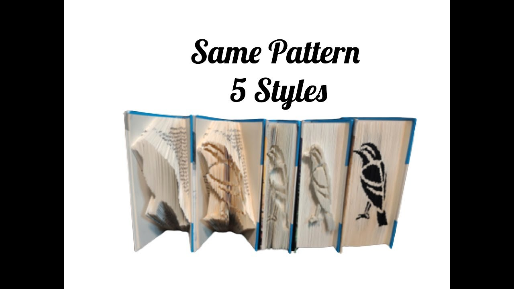](https://www.youtube.com/watch?v=lihhGPYte7I)

## Summary

My journey into book folding really took off once I found the "line templates" technique. It opened up a world of possibilities while keeping the process fun and "brain-hassle-free". Armed with such a versatile tool, I started digging deeper and was amazed by the variety of techniques available and the ingenuity of the community.

While my overview is far from exhaustive (and new, original ways to create book art arise every day), I hope my (teeny-tiny) experience has given you some inspiration. Once you've practiced one or two of these methods, you'll find that your skills are portable; everything else is just a creative variation on the same core principles!

**SPOILER**: I mentioned earlier that the biggest challenge with line templates is actually creating the patterns from your own images. Stay tuned, because I have developed a free tool for it, which I will share in a future article!
