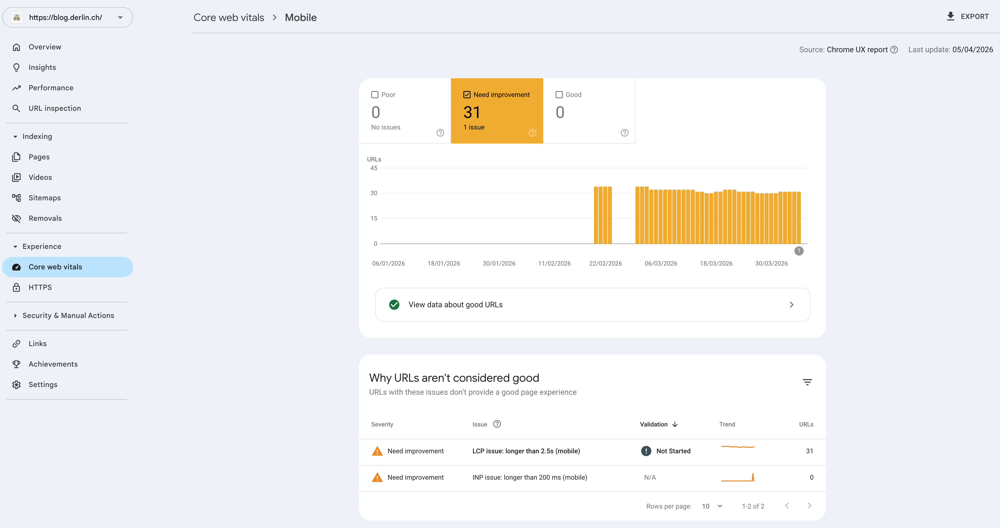
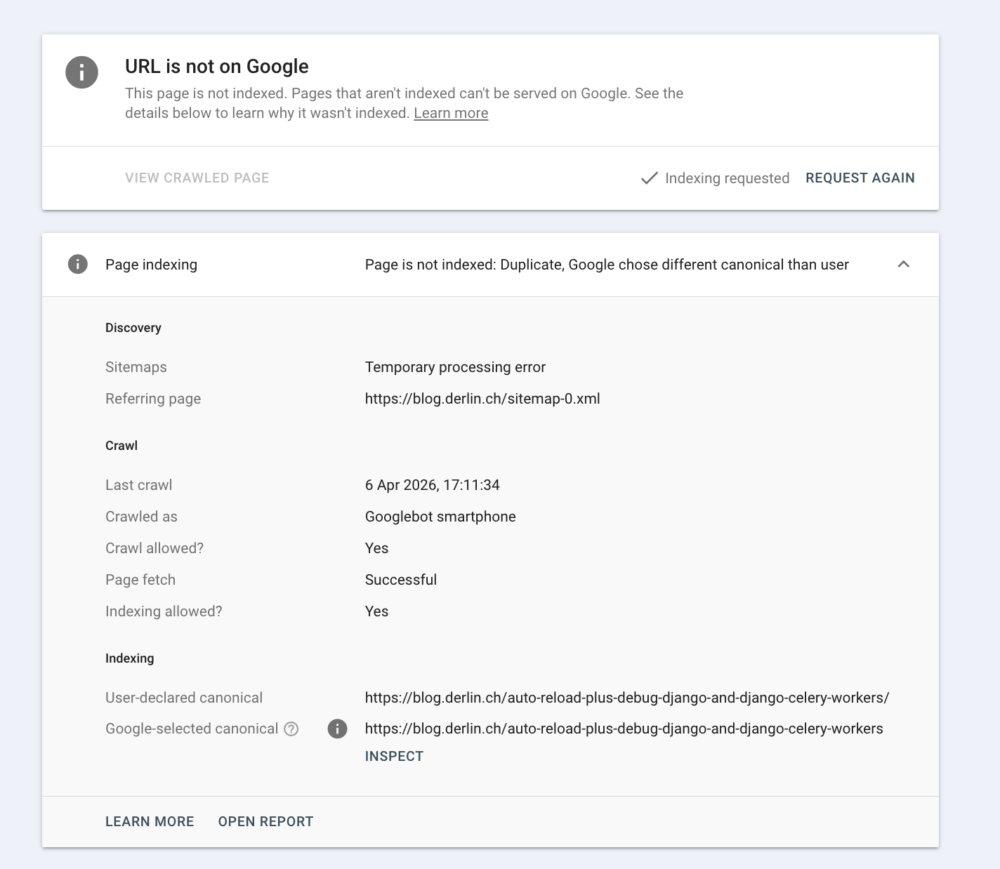

I started this blog in 2021. Back then, [dev.to](https://dev.to) was taking off, but I also wanted a
place I could call home. A real blog with *my* domain on it.

[Hashnode](https://hashnode.com) had everything I needed: markdown editing (with a nice UI!), custom
domains, hassle-free setup, good community. Even backups to Github! However, things have shifted
since the early days. Enough so that I started losing my peace of mind. I finally decided move on.

In this article, I will explain why I switched, to what, and how I managed to not lose all my
indexing and SEO.

## Why hashnode doesn't bring me peace of mind anymore

### Losing days of work without notice

I was editing a blog post on hashnode in early January. I spent hours on it, spread over multiple
days. On the last day, I hit preview and sent the URL to my boyfriend's phone. 404. I went to my
tab, ensured I hit "save" once more, waited for the save icon to show, and refreshed. Error. Seems
like I had lost my session, but hashnode never told me so. I had been editing a page on an
"incognito" window for days, and after logging back in, all of my changes were gone. Irrevocably.

### Alarming community reports

This experience made me search a bit on ways to get support. This is how I stumbled on many alarming
articles and discussions online, about users losing posts, unable to edit or backup their site, the
IOS app gone, and an overall complete lack of support from the hashnode team.

One such report is from GREENflux, who published
[It Might Be Time To Migrate Your Hashnode Blog](https://blog.greenflux.us/it-might-be-time-to-migrate-your-hashnode-blog/)
in July 2025:

> in the last ~6 months, a lot has changed:
> 
> * No post on LinkedIn or X since January 2025
> 
> * No updates to change log since November 2024
> 
> * No Newsletter since October 2024
> 
> * DevRel/Community manager left around same time newsletters stopped
> 
> * Ten’s of support forum posts >30+ days old, with no reply from support
> 
> * New issues with Google indexing, multiple users reported, no word from support
> 
> * Working features being deprecated (custom CSS)

Since then, more and more users have raised complaints or migrated away:

* [Why I’m Leaving Hashnode and Moving to WordPress](https://medium.com/@satyarthshree45/why-im-leaving-hashnode-and-moving-to-wordpress-681cc2562015)
(November 2025)
* [r/hashnode: Why are my articles are getting deleted automatically?](https://www.reddit.com/r/hashnode/comments/1od1d1p/why_are_my_articles_are_getting_deleted/)
  (October 2025)
* [r/hashnode: Articles Keep Getting Deleted](https://www.reddit.com/r/hashnode/comments/1r54dp5/articles_keep_getting_deleted/)
  (February 2026)
* [r/hashnode: Can't we edit our blog articles in hashnode anymore?](https://www.reddit.com/r/hashnode/comments/1rrgerv/cant_we_edit_our_blog_articles_in_hashnode_anymore/)
  (March 2026)

### Unable to export data

It made me paranoid, and I started to check my backups. This was March 2026. The GitHub integration
had gone away from the UI, and nothing had been committed for months. The *export* options were also
nowhere to be found (and still aren't available).

### ...And more

On top of this, I noticed multiple things I am not happy with. To cite a few:

* They constantly change the theme and the look-and-feel of the blog, which sometimes doesn't align
  with my tastes.
* The CDN changed, and some images are now directly served by S3, while others from the CDN.
* The overall performance of the site varies greatly. It is sometimes so bad it triggers alerts!
* With the new editor rehaul, the *raw markdown* toggle is gone.



<details>
<summary>What are LCP and INP?</summary>

**LCP** is short for *Largest Contentful Paint* and tracks loading speed by measuring when the
largest visible element renders. **INP** is short for *Interaction to Next Paint* and measures
responsiveness by checking the latency of user interactions like clicks.
</details>

## How I exported all my posts and images

As I mentioned, the *export* feature is gone from the UI, and a month ago the GitHub integration
was, too (it just came back, but for how long?).

Hopefully, the GraphQL API was still available. It didn't take long to craft a Python script to
download all the posts and the drafts from it, and save everything into a JSON file.

<details>
<summary>Python script used to export the drafts and posts</summary>

```python
import json
import os
import time

import requests


API_URL = "https://gql.hashnode.com"
API_TOKEN = os.getenv("HASHNODE_API_TOKEN")
OUTPUT_FILE = "hashnode_complete_backup.json"

headers = {
    "Authorization": API_TOKEN,
    "Content-Type": "application/json",
}


def run_query(query, variables=None):
    response = requests.post(
        API_URL, headers=headers, json={"query": query, "variables": variables}
    )
    if response.status_code != 200:
        raise Exception(
            f"Query failed with status {response.status_code}: {response.text}"
        )
    return response.json()


# --- QUERIES ---

LIST_PUBS_QUERY = """
query {
  me {
    publications(first: 20) {
      edges { node { id title } }
    }
  }
}
"""

# Query for published posts with pagination
POSTS_PAGINATED_QUERY = """
query GetPosts($id: ObjectId!, $after: String) {
  publication(id: $id) {
    posts(first: 20, after: $after) {
      edges {
        node {
          id
          title
          subtitle
          brief
          slug
          url
          canonicalUrl
          readTimeInMinutes
          publishedAt
          updatedAt
          coverImage {
            url
            isPortrait
            attribution
          }
          author {
            id
            name
            username
          }
          tags {
            id
            name
            slug
          }
          seo {
            title
            description
          }
          content {
            markdown
            html
          }
          features {
            tableOfContents {
              isEnabled
            }
          }
        }
      }
      pageInfo {
        hasNextPage
        endCursor
      }
    }
  }
}
"""

# Query for drafts with pagination
DRAFTS_PAGINATED_QUERY = """
query GetDrafts($after: String) {
  me {
    drafts(first: 20, after: $after) {
      edges {
        node {
          id
          title
          subtitle
          slug
          updatedAt
          coverImage {
            url
          }
          tags {
            name
            slug
          }
          seo {
            title
            description
          }
          content {
            markdown
          }
        }
      }
      pageInfo {
        hasNextPage
        endCursor
      }
    }
  }
}
"""


def get_all_paginated_items(query, query_path, variables=None):
    """Generic helper to loop through GraphQL pages"""
    items = []
    has_next = True
    after_cursor = None

    while has_next:
        vars = variables.copy() if variables else {}
        vars["after"] = after_cursor

        resp = run_query(query, vars)

        # Navigate the JSON path to find the connection object
        data = resp["data"]
        for key in query_path:
            data = data[key]

        # Append nodes
        items.extend([edge["node"] for edge in data["edges"]])

        # Check pagination
        has_next = data["pageInfo"]["hasNextPage"]
        after_cursor = data["pageInfo"]["endCursor"]

        if has_next:
            print(f"  ...fetching next page (current count: {len(items)})")
            time.sleep(0.5)  # Gentle rate limiting

    return items


def main():
    print("🚀 Starting full Hashnode export...")
    full_export = {"publications": [], "drafts": []}

    # 1. Fetch Publications
    pub_resp = run_query(LIST_PUBS_QUERY)
    pubs = pub_resp["data"]["me"]["publications"]["edges"]

    # 2. Loop through Publications for Posts
    for pub in pubs:
        p_id = pub["node"]["id"]
        p_title = pub["node"]["title"]
        print(f"\n📦 Exporting Publication: {p_title}")

        posts = get_all_paginated_items(
            POSTS_PAGINATED_QUERY, ["publication", "posts"], {"id": p_id}
        )

        full_export["publications"].append(
            {"id": p_id, "title": p_title, "posts": posts}
        )

    # 3. Fetch All Drafts
    print("\n📝 Exporting all Drafts...")
    full_export["drafts"] = get_all_paginated_items(
        DRAFTS_PAGINATED_QUERY, ["me", "drafts"]
    )

    # 4. Save to JSON
    with open(OUTPUT_FILE, "w", encoding="utf-8") as f:
        json.dump(full_export, f, indent=4, ensure_ascii=False)

    print(f"\n✅ Success! Saved to {OUTPUT_FILE}")


if __name__ == "__main__":
    main()
```
</details>

Once I had the markdown, HTML and all the metadata, I crafted another Python script to loop through
the posts, extract all the image links, and download them into a folder following the structure
`hashnode_assets/[posts|drafts]/<post-id>/<image-name>`.

<details>
<summary>Python script to download all images from posts</summary>

> [!warning] Not a perfect script!
> 
> It worked for me, but double-check the output to ensure it looks correct

```python
import json
import re
import requests
from pathlib import Path
from urllib.parse import urlparse

# Configuration
INPUT_JSON = Path("hashnode_complete_backup.json")
BASE_IMAGE_DIR = Path("hashnode_assets")

# Regex to find Hashnode CDN URLs
GLOBAL_IMAGE_REGEX = r'(https?://[^\s"\'\)]+?\.(?:png|jpg|jpeg|gif|webp|svg|avif))'

def get_images_from_dict(data_dict):
    """Recursively finds all Hashnode CDN URLs in a dictionary or string."""
    # Convert the entire post/draft object to a string to find URLs in all fields at once
    data_str = json.dumps(data_dict)
    return {i.strip("\\") for i in re.findall(GLOBAL_IMAGE_REGEX, data_str, re.IGNORECASE)}


def download_images_to_subfolder(urls, subfolder_path):
    """Downloads a set of URLs into a specific pathlib directory."""
    if not urls:
        return

    subfolder_path.mkdir(parents=True, exist_ok=True)

    for url in urls:
        try:
            # Clean filename
            clean_url = url.split("?")[0]
            filename = Path(urlparse(clean_url).path).name

            if not filename or "." not in filename:
                filename = f"image_{hash(url)}.jpg"

            target_file = subfolder_path / filename

            # Only download if it doesn't exist
            if not target_file.exists():
                response = requests.get(url, stream=True, timeout=15)
                if response.status_code == 200:
                    with open(target_file, "wb") as f:
                        for chunk in response.iter_content(1024):
                            f.write(chunk)
        except Exception as e:
            print(f"  ⚠️ Failed to download {url}: {e}")


def process_export():
    if not INPUT_JSON.exists():
        print(f"❌ Error: {INPUT_JSON} not found.")
        return

    data = json.load(INPUT_JSON.open(encoding="utf-8"))

    # 1. Process Published Posts (by Publication)
    for pub in data.get("publications", []):
        print(f"📦 Processing Publication: {pub.get('title')}")
        for post in pub.get("posts", []):
            post_id = post.get("id")
            print(f"  📄 Post: {post.get('title')} ({post_id})")

            urls = get_images_from_dict(post)
            folder = BASE_IMAGE_DIR / "posts" / post_id
            download_images_to_subfolder(urls, folder)

    # 2. Process Drafts
    print(f"\n📝 Processing Drafts")
    for draft in data.get("drafts", []):
        draft_id = draft.get("id")
        print(f"  📄 Draft: {draft.get('title') or 'Untitled'} ({draft_id})")

        urls = get_images_from_dict(draft)
        folder = BASE_IMAGE_DIR / "drafts" / draft_id
        download_images_to_subfolder(urls, folder)

    print(f"\n✅ All assets organized in {BASE_IMAGE_DIR}")


if __name__ == "__main__":
    process_export()
```

</details>

## My new solution

I first looked around for another platform, but let's be honest: any platform can die, or make
changes that do not suit our taste. It is time to fire up a custom solution.

### Going with Astro and GitHub Pages

The choice of framework was easy enough. After weighing a bit the pros and cons, I finally settled
for [Astro](https://astro.build/) over [Hugo](https://gohugo.io/) for a single reason: for a
website, going with TypeScript makes sense.

In terms of theme and functionalities, I wanted to stay as close as possible to what I currently
have on hashnode: a simple listing page as home, and dark, centered and elegant article pages
without any fuss. The best was to go with a custom theme, which is not that hard to do in the age of
AI.

In terms of hosting, again multiple options, but for simple static sites I usually end up with
**GitHub Pages**. It is fast, easy to automate, and supporting custom domains.

Finally, for search I opted for [pagefind](https://pagefind.app), a fully static search library that
indexes all the content at build time and provides super fast search without any infrastructure. It
can work with any content, as long as it is HTML.

### The data import

This time, I simply ask my overlord (that is, an AI), to come create the Astro structure based on
the export. The result is a directory per post, with images colocated with the `index.md`.

After this automatic migration, some manual tweaks were required:

- The local image links on Hashnode markdown have this annoying `align="center"` that breaks normal
  markdown parsers. For example:
  ```text
  
  ```

- Links to other pages in the same blog on hashnode's exported markdown are absolute, though ideally
  you want them relative.

- Callouts or other "special" features or hashnode are broken unless you implement them in Astro as
  well. For me, it was mostly the `<callout>`. For example:
  ```html
  <div data-node-type="callout">
  <div data-node-type="callout-emoji">⚠</div> <div data-node-type="callout-text">blabla</div>
  </div>
  ```
  Instead of adding CSS support for this custom HTML (which is annoying in markdown files), I
  installed the [rehype-callout](https://github.com/lin-stephanie/rehype-callouts) plugin in Astro.
  This let's me use the GitHub-Flavored syntax for callouts:
  ```markdown
  > ![warning]
  > blabla
  ```

## The backward-compatibility of links

The biggest requirement for this migration is to keep the <u>exact same links</u> on the new blog,
so all the URLs shared around will still work. Hashnode generates the links `<base_url>/<slug>`
(without trailing slash). Astro lets you define the `slug` in the front matter of each article.
However, the trailing slash that is bothering.

### The fake good idea

At first, I opted for using the `appendSlash` option in Astro and simply set it to `never`. However,
by doing this I had to also switch the build mode from `directory` to `file`. What it does is
creating `dist/<slug>.html` instead of `dist/<slug>/index.html`.

This was working fine (after I tweaked a bit the search to strip the `index.html` from the URL and
other such tweaks), until I tried serving my `dist` folder using `python` instead of the built-in
Astro dev server.

A basic http server will never fall back to `<slug>.html` for a request to `<slug>`!

That was a completely stupid idea from the start, but it made me learn something: always use a
static server to test your `dist` build, never only rely on the dev server shipped with your
framework!


> [!tip]
> 
> If you have python installed, simply use the following at the root of your Astro project:
> 
> ```bash python3 -m http.server -d dist ```
> 
> Don't forget to build your site first!

### The reality (simpler than it looks)

From an SEO perspective, changing URLs to trailing slashes should not be an issue, as long as:

1. The URLs *minus the slash* are the exact same,
2. The URLs *minus the slash* redirect to URLs with trailing slashes (`301`).


So the solution is easy:

- Use Astro's default build mode (`directory`).
- Set the `appendSlash` to `always` in Astro's config.
- Ensure all slugs are exactly the same in Hashnode and Astro.
- Ensure all links (e.g. relative links) use the `/` at the end.
- Ensure the production server is properly redirecting "no slash" to "trailing slash" (with a 301).

On GitHub Pages, the redirects are handled automatically. Assuming you deploy a page
`<slug>/index.html`, asking for `<slug>` will automatically redirect to `<slug>/` and load the
`<slug>/index.html` file. Which is exactly what we want!

Note that if you use the
[@astrojs/sitemap](https://docs.astro.build/en/guides/integrations-guide/sitemap/), a sitemap with
trailing slashes will be available at `<site>/sitemap-index.xml`.


## Testing the new site

Before switching, I have to test the new website on GitHub Pages using the default URL:
`https://<user>.github.io/<repository>` (see Astro's documentation on
[how to deploy on GitHub Pages](https://docs.astro.build/en/guides/deploy/github/)). However, this
website <u>MUST NOT be crawled</u>, otherwise it will trigger a load of SEO issues.

To be on the safe side:

1. Ensure the canonical URL *on every page* is the final, production URL. And this even when hosted
   somewhere else or running locally.
   ```html
   <link rel="canonical" href="https://blog.derlin.ch/why-i-moved-away-from-hashnode/">
   ```

2. Dynamically generate a `robots.txt` based on the host that will `Disallow: /` on all but the
   final domain. Since this is environment-dependent, use a
   [Static File Endpoints](https://docs.astro.build/en/guides/endpoints/#static-file-endpoints) such
   as the following in `pages/robots.txt.js`:
   ```js
   export function GET({ params, request }) {
     if (import.meta.env.BASE_URL.includes("blog.derlin.ch")) {
       const robotsTxt = `User-agent: *
   Allow: /
   Sitemap: https://blog.derlin.ch/sitemap-index.xml
   `;
       return new Response(robotsTxt, {
         headers: { "Content-Type": "text/plain" },
       });
     }

     return new Response("User-agent: *\nDisallow: /", {
       headers: { "Content-Type": "text/plain" },
     });
   }
   ```

> [!note]
> Just for added security, I also added this to my `BaseHead.astro` responsible for generating the
> `<head>` content:
>  ```html
>  {!import.meta.env.BASE_URL.includes("blog.derlin.ch") && <meta name="robots" content="noindex, nofollow" />}
>  ```

This way, the new site can be tested as much as needed without interfering with the live site or the
SEO.

## The switch

First, some final checks:

* The new sitemap looks good, and the hashnode sitemap (`sitemap.xml`) return `404`,
* The canonical meta tags and all internal links use the trailing slash,
* The `robots.txt` is correct,
* The old URLs (without trailing slash) return a `301`.

If all looks good, the switch is the easy part:

1. Lower the TTL on the `blog.derlin.ch` DNS record
2. Rebuild the website on GitHub, telling Astro it is served on the live site (environment variable
   `SITE=https://blog.derlin.ch`)
3. Add the domain to GitHub Pages
4. Switch the DNS to GitHub
5. Wait a bit and panic because GitHub's DNS checks take a long time to propagate: even with a TTL
   of 1s, it takes at least 5min for GitHub to properly validate it.
6. Head over to the Google Search Console, and submit the new sitemap link.

And we are live!

## The re-indexing on GSC

I migrated on April 6th in the afternoon. Two days later (April 8th), I received a notification from
the Google Search Console (GSC):

> New reasons prevent pages in a sitemap from being indexed on site https://blog.derlin.ch/

The issue, "*Duplicate, Google chose different canonical than user*", applies to all the new
trailing slash URLs. If I inspect one of those URLs, it shows me the following:



The indexing section at the bottom shows the "smoking gun":

* User-declared canonical: `.../auto-reload...workers/` (with slash)
* Google-selected canonical: `.../auto-reload...workers` (no slash)

Google’s index is "sticky." It has historical data (clicks, backlinks) pointing to the no-slash
version. It sees the new page, but is insisting that the old URL structure is the "correct" one to
show in search results.

However, this makes it stuck in a loop of its own making: it won't index the new one because it's a
"duplicate," and it won't index the old one because it's a redirect.

One of the frictions comes from the fact that that old sitemap was last crawled on very recently.
Thus:

* It knows the old URLs from the April 3rd crawl.
* It's discovering the new slash-URLs via the April 7th crawl.
* Because the content is identical, it's defaulting to the "oldest" version it trusts.

From there, nothing much to do except wait for Google to figure it out by itself. To help the
process:

* Hit the "*Request Indexing*" button on the page I inspected above,
* Hit the "*Validate Fix*" on the "*Duplicate, Google chose different canonical than user*" issue
  page.

Validation usually triggers a more aggressive re-scan of the affected paths within 24-72 hours.
