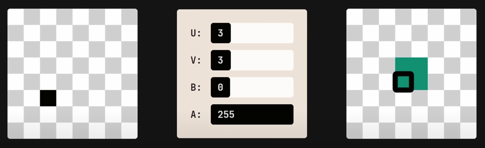
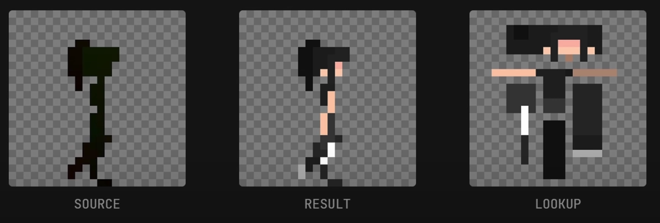
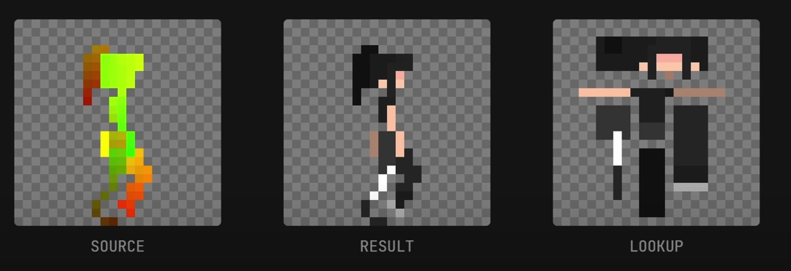
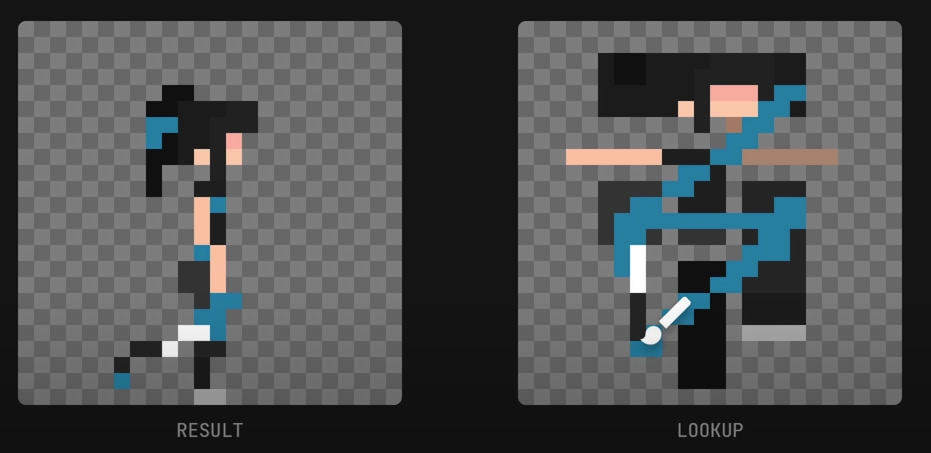
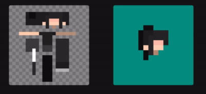

I am not involved in animation and can hardly draw a cat. I am, however, fascinated with technologies and coding ideas. This one really blew me away: such a simple idea, such a potentially big impact!

* * *

> *Learning how people find new ways of making their life easier has always been a source of inspiration. I believe we should, as developers, strive every day to do the same.* ‒ me

* * *

<iframe src="https://www.youtube-nocookie.com/embed/HsOKwUwL1bE" frameborder="0" allowfullscreen></iframe>
 

The video is from a 👾 devlog 👾 on the indie game [Astortion](https://store.steampowered.com/app/1993980/Astortion/) - a puzzle-platformer with 2D pixel art.

(I can't stress this enough: this is not my idea nor my video)

### The problem

In 3D, a model is made of two separate parts: a *mesh* that defines the character's appearance, and a set of *bones* used to animate it. Each bone influences a different part of the mesh, allowing us to move the character freely. If we suddenly want to change the color of the shirt or give it a hairpin, we change it in the mesh only and all our animations are directly updated.

With 2D animations (that do not use a 3D model behind the scene), there is no such separation: each animation is a succession of drawings, that have to be edited separately if we want to change something.

Or do we?

### The revolutionary idea

The idea of [aarthificial](https://www.youtube.com/@aarthificial) is basically UV mapping, but for sprites.

Each pixel in an image is represented by four values: red, green, blue, and alpha. Those bytes do not mean anything until a *shader* interprets and turns them into color.

So what if we take the first two bytes, *red* and *green*, and say they represent the `x` and `y` coordinates on another texture? The color of the pixel on this other texture (the *lookup*) would be the actual color the shader renders:

{.img-left}

Using a real pixel character, this is what it looks like using this technique:

{.img-left}

Since the red and green values representing coordinates are small, we only see black on the source (right). So let's make the changes in coordinates more obvious:

{.img-left}

### Endless possibilities

And now you have it! Want to make your character a bit muddy after going through the jungle? Simply edit the lookup texture! No need to touch any of the animations. You could even let the player customize his character as he wants:

{.img-left}

Since the lookup shows the "full body", you can also put a hairpin on one side of the head, and the 2D animations will properly show or hide it depending on the angle. And this is for free:

{.img-left}

**✨✨ This is awesome !✨✨**

To know more, watch his other video with an in-depth explanation and source code ⮕ [Explaining my Pixel Art Animation Process](https://www.youtube.com/watch?v=nYch_TIkq6w).

* * *

Note: to apply this idea, you need to code a custom shader with this lookup logic in Unity, but this is the easy part. I wouldn't be surprised to see an official one pop up in the near future!
